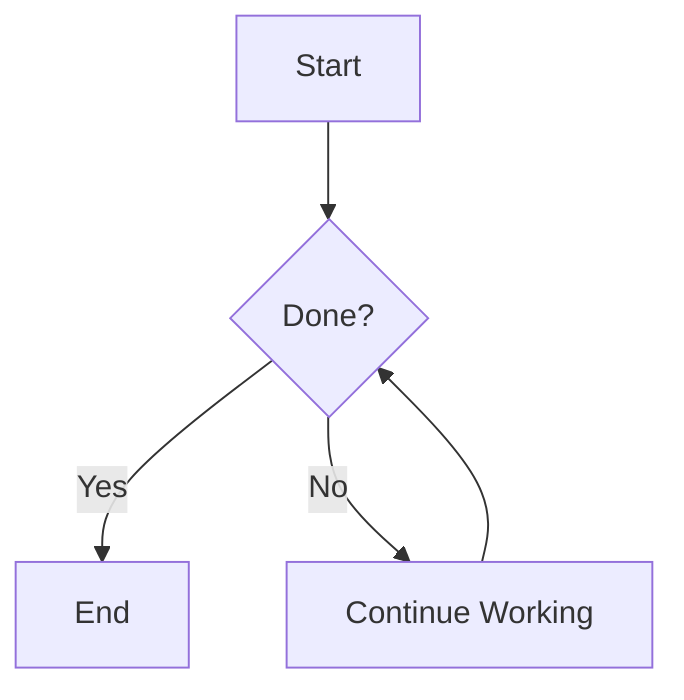

# InferX

<div align="center">


A powerful macOS AI chat application supporting multiple AI model providers with a modern conversation interface and rich features.

[](https://swift.org)
[](https://www.apple.com/macos)
[](LICENSE)

</div>

---

## 📖 Table of Contents

- [Features](#-features)
- [Supported Model Providers](#-supported-model-providers)
- [System Requirements](#-system-requirements)
- [Installation](#-installation)
- [Project Architecture](#-project-architecture)
- [Core Modules](#-core-modules)
- [Tech Stack](#-tech-stack)
- [Development Guide](#-development-guide)
- [Usage Guide](#-usage-guide)
- [Testing](#-testing)
- [Contributing](#-contributing)
- [License](#-license)

---

## ✨ Features

### Core Features

- 🤖 **Multi-Model Support**: Support for Ollama, Gemini, HuggingFace, and MLX model providers
- 💬 **Modern Chat Interface**: Smooth chat experience with real-time streaming responses
- 📎 **Multimedia Attachments**: Support for images, documents, and various file types
- 📝 **Markdown Rendering**: Full Markdown support including code highlighting and math formulas
- 🎨 **Code Syntax Highlighting**: Code highlighting powered by Splash and Highlightr
- 📊 **Chart Visualization**: Mermaid chart rendering (flowcharts, pie charts, bar charts, etc.)
- 🔍 **Full-Text Search**: Powerful message search and filtering capabilities
- 💾 **Local Storage**: Data persistence using SwiftData
- 🎭 **Theme Switching**: Support for light/dark mode

### Advanced Features

- 🧠 **Thinking Display**: Show model's reasoning process
- 📈 **Usage Statistics**: Real-time token usage and cost tracking
- 🔒 **Secure Storage**: Secure API key storage using Keychain
- 🌐 **Proxy Support**: HTTP/HTTPS proxy configuration
- 📦 **Model Management**: Convenient local model downloading and management
- 🔄 **Incremental Rendering**: Optimized streaming content rendering performance
- 🎯 **Fine-Grained Control**: Detailed model parameter configuration (temperature, Top-P, Top-K, etc.)

---

## 🎯 Supported Model Providers

### 1. Ollama

- Locally-run open-source LLM models
- Support for multiple open-source models (Llama, Mistral, Qwen, etc.)
- Fully offline operation

### 2. Google Gemini

- Google's latest multimodal AI model
- Support for text and image inputs
- API key configuration

### 3. HuggingFace

- Access to massive models on HuggingFace Hub
- Local caching and model downloading support
- MLX optimization support

### 4. MLX Community

- Apple Silicon optimized models
- High-performance local inference
- Apple Neural Engine acceleration support

---

## 💻 System Requirements

- **Operating System**: macOS 15.0 (Sequoia) or later
- **Processor**: Apple Silicon (M1/M2/M3) or Intel
- **Memory**: 8GB or more recommended
- **Storage**: At least 500MB available space (excluding model files)
- **Development Tools**: Xcode 16.2 or later

---

## 🚀 Installation

### Building from Source

1. **Clone the repository**

   ```bash
   git clone https://github.com/yourusername/InferX.git
   cd InferX
   ```

2. **Open the project**

   ```bash
   open InferX.xcodeproj
   ```

3. **Install dependencies**

   The project uses Swift Package Manager, Xcode will automatically download dependencies:
   - SwiftUIIntrospect
   - Splash (code highlighting)
   - SwiftUIX
   - MarkdownUI
   - Defaults
   - AlertToast
   - Highlightr
   - AnyCodable
   - Luminare
   - Alamofire
   - MLX Swift Examples
   - SwiftSoup
   - Semaphore
   - AsyncAlgorithms

4. **Configure Development Team**
   - Set your development team in Xcode's Signing & Capabilities

5. **Build and Run**
   - Select InferX scheme
   - Press Cmd+R to run

---

## 🏗️ Project Architecture

```plaintext
InferX/
├── InferX/                          # Main application directory
│   ├── InferXApp.swift             # Application entry point
│   ├── Assets.xcassets/             # Asset files (icons, images, etc.)
│   ├── Localizable.xcstrings        # Localization strings
│   │
│   ├── Views/                       # View layer
│   │   ├── ContentView.swift       # Main view
│   │   ├── SettingsView.swift      # Settings view
│   │   ├── Conversation/           # Conversation-related views
│   │   │   ├── ConversationView.swift
│   │   │   ├── ConversationDetail.swift
│   │   │   ├── ConversationMessage.swift
│   │   │   ├── ConversationInput.swift
│   │   │   ├── ConversationInputBar.swift
│   │   │   ├── ConversationToolBar.swift
│   │   │   ├── ConversationSidebar.swift
│   │   │   └── ...
│   │   └── ModelManager/           # Model management views
│   │       ├── ModelAPIManagerView.swift
│   │       ├── ModelAPIDetailView.swift
│   │       ├── ModelAddSheetView.swift
│   │       ├── ModelDetailView.swift
│   │       ├── HFModels/           # HuggingFace models
│   │       └── MLXCommunity/       # MLX community models
│   │
│   ├── ViewModels/                  # View model layer
│   │   ├── ConversationModel.swift
│   │   ├── ConversationDetailModel.swift
│   │   ├── ModelManagerModel.swift
│   │   ├── HFModelListModel.swift
│   │   └── SettingsModel.swift
│   │
│   ├── LLModelServices/             # AI model service layer
│   │   ├── ModelService.swift      # Model service base class
│   │   ├── OllamaService.swift     # Ollama integration
│   │   ├── GeminiService.swift     # Google Gemini integration
│   │   └── HuggingFaceService.swift # HuggingFace integration
│   │
│   ├── SwiftDataModels/             # Data model layer
│   │   ├── Conversation+Extensions.swift
│   │   ├── Message+Extensions.swift
│   │   ├── Model+Extensions.swift
│   │   ├── ModelAPI+Extensions.swift
│   │   ├── AppMigrationPlan.swift
│   │   └── SchemaV0/               # Data model versions
│   │
│   ├── SwiftDataServices/           # Data service layer
│   │   ├── SwiftDataProvider.swift
│   │   └── MessageService.swift
│   │
│   ├── Components/                  # Reusable components
│   │   ├── StreamingMarkdownView.swift
│   │   ├── CodeBlockView.swift
│   │   ├── MathWebView.swift
│   │   ├── MermaidParser.swift
│   │   ├── ThinkingView.swift
│   │   ├── WebView.swift
│   │   ├── MessageAttachmentView.swift
│   │   └── ...
│   │
│   ├── Extensions/                  # Extensions
│   │   ├── String+Extensions.swift
│   │   ├── Color+Extensions.swift
│   │   ├── FileManager+Extensions.swift
│   │   ├── Window+Extensions.swift
│   │   └── ...
│   │
│   └── Utils/                       # Utilities
│       ├── ProxiedURLSessionFactory.swift
│       ├── StreamingDelegate.swift
│       └── HuggingfaceHub/         # HuggingFace Hub utilities
│
├── InferXTests/                     # Unit tests
│   ├── InferXTests.swift
│   ├── LLModelServiceTests.swift
│   └── OllamaServiceTests.swift
│
└── InferX.xcodeproj/                # Xcode project file
```

---

## 🔧 Core Modules

### 1. Conversation Management

**Main Files**:

- `ConversationModel.swift`: Conversation list management
- `ConversationDetailModel.swift`: Individual conversation details and message flow
- `ConversationView.swift`: Main conversation interface

**Features**:

- Create, edit, and delete conversations
- Send and receive messages
- Streaming response handling
- Message search and filtering
- Attachment upload and management

### 2. Model Manager

**Main Files**:

- `ModelManagerModel.swift`: Model manager
- `ModelService.swift`: Unified model service interface
- `OllamaService.swift`, `GeminiService.swift`, `HuggingFaceService.swift`: Provider implementations

**Features**:

- Add and configure API endpoints
- Model list retrieval and updates
- Local model downloading and caching
- Model parameter configuration
- API key management

### 3. Message Rendering

**Main Files**:

- `StreamingMarkdownView.swift`: Streaming Markdown rendering
- `CodeBlockView.swift`: Code block rendering
- `MathWebView.swift`: LaTeX mathematical formulas
- `MermaidParser.swift`: Mermaid chart parsing

**Features**:

- Incremental Markdown rendering
- Syntax highlighting
- Math formula rendering (KaTeX)
- Chart visualization

### 4. Data Persistence

**Main Files**:

- `SwiftDataProvider.swift`: Data provider
- `MessageService.swift`: Message service
- Schema V0 model definitions

**Features**:

- SwiftData integration
- Incremental data migration
- Message querying and pagination
- Data export

### 5. HuggingFace Hub Integration

**Main Files**:

- `Utils/HuggingfaceHub/`: HF Hub utilities
- `HFModelListModel.swift`: HF model list management

**Features**:

- Model search and discovery
- Model file downloading
- Cache management
- Progress tracking

---

## 🛠️ Tech Stack

### Core Frameworks

- **SwiftUI**: Declarative UI framework
- **SwiftData**: Data persistence and model management
- **Combine**: Reactive programming
- **Async/Await**: Modern asynchronous programming

### Third-Party Dependencies

#### UI & Interaction

- **SwiftUIIntrospect**: Access underlying UIKit/AppKit views
- **SwiftUIX**: Extended SwiftUI functionality
- **AlertToast**: Elegant toast notifications
- **Luminare**: UI enhancements

#### Content Rendering

- **MarkdownUI**: Markdown rendering (with LaTeX support)
- **Splash**: Code syntax highlighting
- **Highlightr**: Advanced syntax highlighting
- **SwiftSoup**: HTML parsing

#### Networking & Data

- **Alamofire**: HTTP networking
- **AnyCodable**: Dynamic type encoding/decoding
- **AsyncAlgorithms**: Asynchronous algorithms

#### AI & ML

- **MLX Swift Examples**: Apple Silicon optimized ML framework
  - MLXEmbedders
  - MLXLLM
  - MLXLMCommon
  - MLXVLM

#### Utilities

- **Defaults**: User preferences management
- **Semaphore**: Concurrency control
- **ArgumentParser**: Command-line argument parsing

---

## 💡 Development Guide

### Code Structure Guidelines

1. **MVVM Architecture**: Strictly follow the Model-View-ViewModel pattern
2. **Actor Concurrency**: Use actors to ensure thread safety
3. **Swift 6.0**: Enable strict concurrency checking
4. **@MainActor**: Mark UI-related code with @MainActor

### Adding a New AI Provider

1. Create a new service class in `LLModelServices/`
2. Implement the following protocol methods:

   ```swift
   func getModels(modelAPI: ModelAPIDescriptor, handler: @escaping @Sendable (ModelsCompletion) async -> Void)
   func chatModel(modelAPI: ModelAPIDescriptor, for chatRequest: ChatRequest, handler: @escaping @Sendable (ChatCompletion) async -> Void)
   ```

3. Register the new provider in `ModelService.swift`
4. Add corresponding UI configuration interface

### Data Model Migration

The project uses SwiftData's versioned migration system:

1. Define a new Schema version
2. Add migration logic in `AppMigrationPlan.swift`
3. Test migration paths

### Custom UI Components

All reusable components go in the `Components/` directory:

- Follow SwiftUI best practices
- Provide Previews
- Document parameters

---

## 📚 Usage Guide

### First Launch

1. **Configure Model API**
   - Open Settings (Cmd+,)
   - Select "Model API Manager"
   - Add at least one API configuration

2. **Ollama Setup** (Recommended for beginners)

   ```bash
   # Install Ollama
   brew install ollama

   # Start service
   ollama serve

   # Download model
   ollama pull llama2
   ```

   Then in InferX:
   - API Name: `ollama`
   - Endpoint: `http://localhost:11434`

3. **Gemini Setup**
   - Get API Key: <https://makersuite.google.com/app/apikey>
   - API Name: `gemini`
   - Endpoint: `https://generativelanguage.googleapis.com`
   - API Key: Paste your key

### Creating Conversations

1. Click the "+" button in the top left
2. Select a model
3. Start chatting

### Sending Attachments

- Click the 📎 icon in the input field
- Supports images, PDFs, text files, etc.
- Automatically generates thumbnails

### Advanced Features

#### Code Highlighting

````markdown
```python
def hello():
    print("Hello, InferX!")
```
````

#### Math Formulas

```markdown
Inline formula: $E = mc^2$

Block formula:
$$
\int_{-\infty}^{\infty} e^{-x^2} dx = \sqrt{\pi}
$$
```

#### Mermaid Charts

````markdown

````

---

## 🧪 Testing

### Running Tests

```bash
# In Xcode
Cmd + U

# Or using command line
xcodebuild test -scheme InferX -destination 'platform=macOS'
```

### Test Coverage

- **LLModelServiceTests**: Model service tests
- **OllamaServiceTests**: Ollama integration tests
- More tests continuously being added...

### Mock Testing

The project uses protocols and dependency injection for easy mock testing:

```swift
@Test("loadModels successfully update new models")
func loadModels_success() async throws {
    let mockLoader = mockLoader(models: [LLModel(name: "Test Model")])
    service.setModelLoader(modelProvider: .ollama, modelLoader: mockLoader)
    await service.loadModels(modelProvider: .ollama)
    // Assert...
}
```

---

## 🌟 Core Features Deep Dive

### 1. Streaming Responses

True streaming processing using `AsyncThrowingStream`:

```swift
for try await completion in stream {
    switch completion {
    case .receiving(let response):
        // Incremental UI updates
    case .finished:
        // Completion handling
    case .failure(let error):
        // Error handling
    }
}
```

### 2. Incremental Markdown Rendering

Custom `IncrementalMarkdownParser` avoids re-rendering the entire document:

```swift
func updateContent(_ newContent: String) {
    let diff = calculateDiff(oldContent, newContent)
    renderDiff(diff) // Only render changed parts
}
```

### 3. Secure File Access

Using Security-Scoped Bookmarks to access files outside the sandbox:

```swift
func securityAccessFile(url: URL) -> URL? {
    guard url.startAccessingSecurityScopedResource() else {
        return nil
    }
    // Use file...
    return url
}
```

### 4. Smart Caching

Multi-tier caching strategy for HuggingFace models:

- Memory cache: Fast access to frequently used model information
- Disk cache: Persistent model files
- Lazy loading: Download and load on demand

---

## 🔐 Security

- **API Keys**: Stored securely in system Keychain
- **Sandbox**: Full App Sandbox support
- **File Access**: Security-Scoped Bookmarks
- **Networking**: HTTPS and proxy configuration support

---

## 🚧 Known Issues

- Does not support macOS versions below 15.0
- Some MLX models require Apple Silicon
- Large file attachments may cause memory pressure

---

## 📝 Changelog

### v1.0.0 (Current)

- ✅ Multi-model provider support
- ✅ Streaming conversations
- ✅ Markdown and code highlighting
- ✅ File attachments
- ✅ Local data persistence
- ✅ Model manager
- ✅ HuggingFace integration

---

## 🤝 Contributing

Contributions are welcome! Please follow these steps:

1. Fork the project
2. Create a feature branch (`git checkout -b feature/AmazingFeature`)
3. Commit your changes (`git commit -m 'Add some AmazingFeature'`)
4. Push to the branch (`git push origin feature/AmazingFeature`)
5. Open a Pull Request

### Contribution Guidelines

- Follow Swift coding conventions
- Add appropriate comments and documentation
- Include unit tests
- Update README if necessary

---

## 📄 License

This project is licensed under the MIT License - see the [LICENSE](LICENSE) file for details

---

## 🙏 Acknowledgments

Thanks to the following open-source projects:

- [Swift Markdown UI](https://github.com/swiftlang/swift-markdown-ui)
- [Splash](https://github.com/JohnSundell/Splash)
- [MLX Swift](https://github.com/ml-explore/mlx-swift)
- [Alamofire](https://github.com/Alamofire/Alamofire)
- [SwiftMath](https://github.com/mgriebling/SwiftMath)
- [HuggingfaceHub](https://github.com/johnmai-dev/HuggingfaceHub)
- And all other dependent open-source libraries

---

## 📧 Contact

- **Author**: mingdw (menriothink@gmail.com)
- **Project Homepage**: [GitHub Repository](https://github.com/menriothink/InferX)
- **Issue Tracker**: [Issues](https://github.com/menriothink/InferX/issues)

---

## 🎯 Roadmap

### Short-term Plans

- [ ] Support for more AI providers (Anthropic Claude, OpenAI)
- [ ] Conversation export (Markdown, PDF)
- [ ] Plugin system
- [ ] Voice input support

### Mid-term Plans

- [ ] iOS version
- [ ] iCloud sync
- [ ] Custom prompt library
- [ ] RAG (Retrieval-Augmented Generation) support

### Long-term Plans

- [ ] Local vector database
- [ ] Enhanced multimodal support
- [ ] Collaboration features
- [ ] API service

---

<div align="center">

**⭐ If this project helps you, please give it a Star!**

Made with ❤️ by mingdw

</div>
