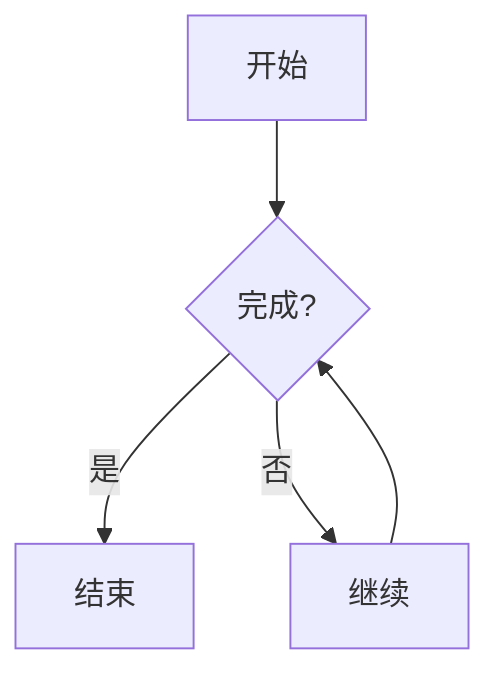

# InferX

<div align="center">


一个功能强大的 macOS AI 聊天应用，支持多种 AI 模型提供商，提供现代化的对话界面和丰富的功能特性。

[](https://swift.org)
[](https://www.apple.com/macos)
[](LICENSE)

[English](README.md) | 简体中文

</div>

---

## ✨ 主要特性

- 🤖 **多模型支持**: Ollama、Gemini、HuggingFace、MLX
- 💬 **流式对话**: 实时响应，流畅体验
- 📝 **Markdown 渲染**: 完整支持代码高亮和数学公式
- 📊 **图表可视化**: Mermaid 图表渲染
- 📎 **文件附件**: 支持图片、文档等多种格式
- 🎭 **主题切换**: 亮色/暗色模式
- 🔒 **安全存储**: Keychain 密钥管理
- 💾 **本地持久化**: SwiftData 数据管理

## 🚀 快速开始

### 系统要求

- macOS 15.0+ (Sequoia)
- Xcode 16.2+
- Apple Silicon 或 Intel 处理器

### 安装步骤

```bash
# 克隆仓库
git clone https://github.com/menriothink/InferX.git
cd InferX

# 打开项目
open InferX.xcodeproj

# 在 Xcode 中按 Cmd+R 运行
```

## 📖 使用指南

### 配置 Ollama（推荐新手）

```bash
# 安装 Ollama
brew install ollama

# 启动服务
ollama serve

# 下载模型
ollama pull llama2
```

在 InferX 中配置：
- API 名称: `ollama`
- Endpoint: `http://localhost:11434`

### 配置 Gemini

1. 获取 API Key: <https://makersuite.google.com/app/apikey>
2. 在 InferX 设置中添加：
   - API 名称: `gemini`
   - Endpoint: `https://generativelanguage.googleapis.com`
   - 粘贴 API Key

## 🏗️ 项目架构

```plaintext
InferX/
├── Views/              # 视图层
│   ├── Conversation/  # 对话界面
│   └── ModelManager/  # 模型管理
├── ViewModels/         # 视图模型
├── LLModelServices/    # AI 服务层
├── SwiftDataModels/    # 数据模型
├── Components/         # 可复用组件
├── Extensions/         # 扩展
└── Utils/             # 工具类
```

## 🛠️ 技术栈

### 核心框架
- SwiftUI + SwiftData
- Combine + Async/Await
- Actor 并发模型

### 主要依赖
- **MarkdownUI**: Markdown 渲染（支持 LaTeX）
- **Splash/Highlightr**: 代码高亮
- **MLX Swift**: Apple Silicon 优化
- **Alamofire**: 网络请求
- **Defaults**: 用户设置

## 🌟 核心功能

### 流式响应
```swift
for try await completion in stream {
    switch completion {
    case .receiving(let response):
        // 实时更新 UI
    case .finished:
        // 完成处理
    case .failure(let error):
        // 错误处理
    }
}
```

### Markdown 功能

**代码高亮**:
````markdown
```python
def hello():
    print("Hello, InferX!")
```
````

**数学公式**:
```markdown
行内: $E = mc^2$

块级:
$$
\int_{-\infty}^{\infty} e^{-x^2} dx = \sqrt{\pi}
$$
```

**Mermaid 图表**:
````markdown

````

## 🧪 测试

```bash
# 运行测试
xcodebuild test -scheme InferX -destination 'platform=macOS'
```

## 🤝 贡献

欢迎贡献！请：

1. Fork 项目
2. 创建特性分支
3. 提交更改
4. 开启 Pull Request

## 🎯 开发路线图

### 短期
- [ ] 支持 Claude、OpenAI
- [ ] 对话导出
- [ ] 插件系统

### 中期
- [ ] iOS 版本
- [ ] iCloud 同步
- [ ] RAG 支持

### 长期
- [ ] 向量数据库
- [ ] 协作功能
- [ ] API 服务

## 📄 许可证

MIT License - 详见 [LICENSE](LICENSE)

## 📧 联系方式

- 作者: mingdw (menriothink@gmail.com)
- 项目: [GitHub](https://github.com/menriothink/InferX)
- 问题: [Issues](https://github.com/menriothink/InferX/issues)

---

<div align="center">

**⭐ 如果觉得有用，请给个 Star！**

Made with ❤️ by mingdw

</div>
